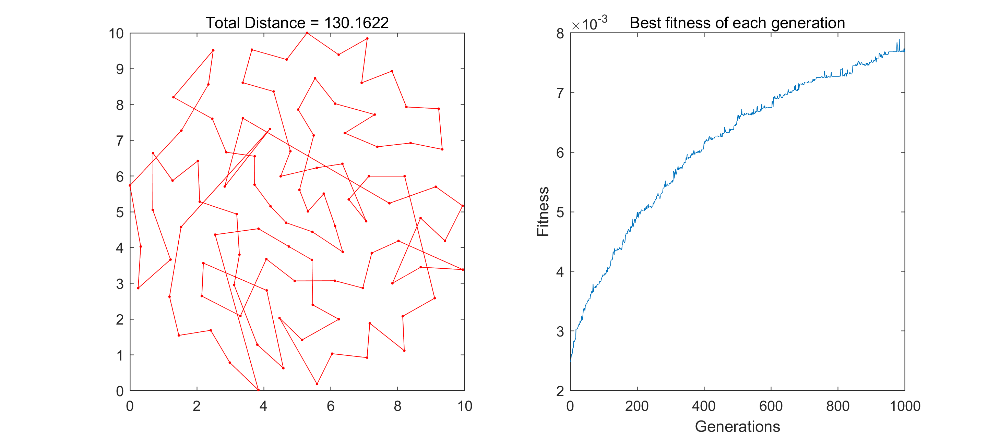

## Model functions

`cross.m:`     cross function;
`fitness.m`     fitness function;

`mutation1.m`   mutation with swap operator;
`mutation2.m`   mutation with flip operator;
`mutation3.m`   mutation with slide operator;

`select.m`      select with roulette-wheel selection;
`select1.m`     select with tournament selection;
`select2.m`     select with ranking selection;

`GaTSp.m`       run with roulette-wheel selection;
`GaTSp1.m`       run with ranking selection;
`GaTSp2.m`       run with tournament selection;

`drawTSP.m`     plot the figure;
`drawTSP1.m`    plot the route figure;

`test1.m`       run with different mutation operator;

`test2.m`       run with different population number;

`test3.m`       run with  different maximum generation number;

Note: All the above run with roulette-wheel selection!

`test4.m`       run with different selection methods;

`test5.m` ,`GaTSP3.m`      run with swap, flip and slide, but without cross-over

`CalDist.m` , `myDistance.m`    calculate distance

## Demonstration

#### Part1 Select the mutation operator

 With 1000  as maximal generation and 200 as the population member, try swap, flip and slide as the mutation operator seperately.

Use swap as the mutation operator, the result as follows.

Use flip as the mutation operator, the result as follows.

Use slide as the mutation operator, the result as follows.

As a result, we should select flip as the mutation operator because the result using it has the least distance. And in the folling calculation, we usually use flip as the default mutation operator.

#### Part2 Select the appropriate population number

Set the maximum generation number as 1000, change the population number from 50 to 200, and find the best result.

With 50 as the population number, the result as follows.

With 100 as the population number, the result as follows.

With 150 as the population number, the result as follows.

With 200 as the population number, the result as follows.

As a result, we should chose 200 as the population number(the bigger the better, although the 150's has a smaller distance, but we do not know if too large).

#### Part3 Select the appropriate generation number

Set the population number as 50(for shorter calculation time), change the  maximum generation from 1000 to 10000, then find the best result.

With 1000 as the maximum generation number, the result as follows.

With 3000 as the maximum generation number, the result as follows.

With 7000 as the maximum generation number, the result as follows.

With 10000 as the maximum generation number, the result as follows.

The maximun generation number changes from 1000 to 10000(1000 as interval, and we computed all of them but only select several here), the result shows that larger maximun generation number will get the smaller distance, so we should selet 10000 as the maximum generation number.

#### Part4 Chose the selection methods

In the calculation above, we use roulette-wheel  as the defult seletcion, and we then try to use other selection methods including ranking selection and tournament selection. We use 200 as the population number and 10000 as the the maximum generation number. The results are as follows.

Use roulette-wheel selection.

Use ranking selection.

Use tournament selection.

